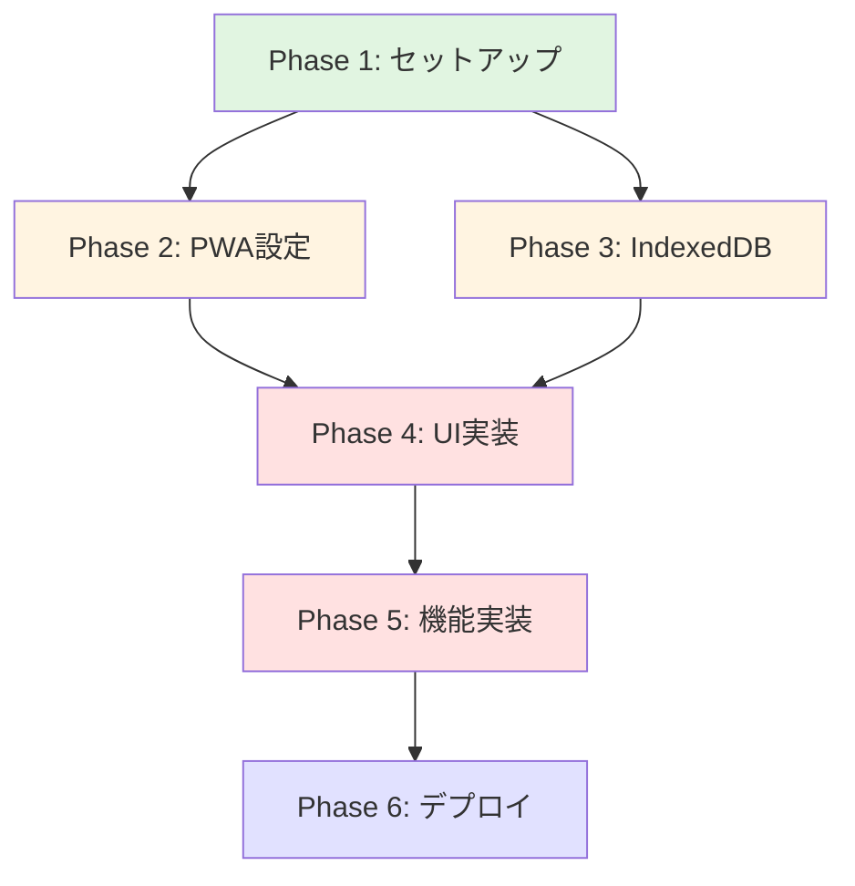
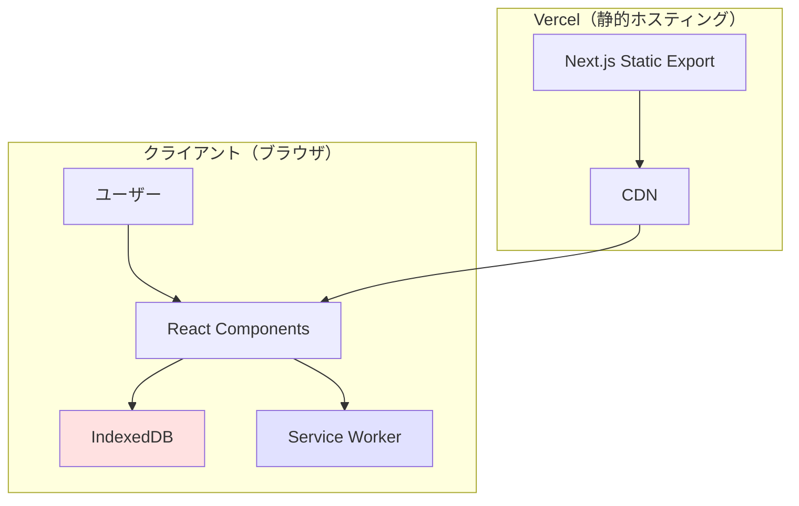
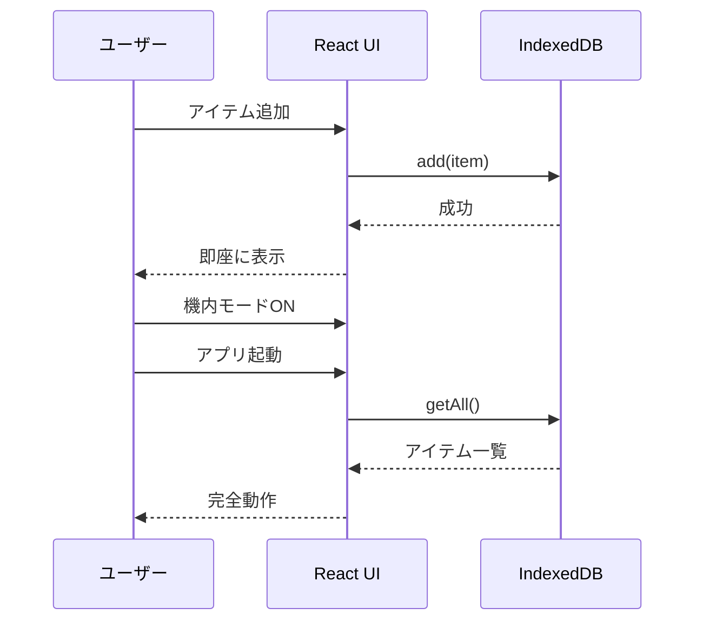

# Offlist プロジェクト全体概要

**作成日**: 2025年10月23日
**ドキュメントバージョン**: 1.0
**対象者**: 開発者、プロジェクトマネージャー

---

## 目次

1. [プロジェクト概要](#プロジェクト概要)
2. [ビジョンと目的](#ビジョンと目的)
3. [開発方針と設計思想](#開発方針と設計思想)
4. [技術スタック詳細解説](#技術スタック詳細解説)
5. [全Phase一覧とフローチャート](#全phase一覧とフローチャート)
6. [開発スケジュール見積もり](#開発スケジュール見積もり)
7. [リスク管理マトリクス](#リスク管理マトリクス)
8. [成功基準（KPI）](#成功基準kpi)

---

## プロジェクト概要

### プロジェクト名
**Offlist (オフリスト)** - オフラインファーストPWA買い物リストアプリ

### エグゼクティブサマリー

Offlistは、PWA(Progressive Web App)技術をフル活用した買い物リストアプリです。最大の特徴は**機内モードでも完璧に動作する**オフラインファースト設計。IndexedDBをプライマリストレージとして採用し、ネットワーク接続に一切依存しません。

**核心的価値:** 「Web技術でネイティブアプリ並みの体験を実現できる」という技術デモ

**デモシナリオ:**
1. ブラウザからアクセス
2. ホーム画面に追加（PWAインストール）
3. **スマホを機内モードに**
4. アプリが完璧に動作 ← 強烈なインパクト

### プロジェクトの背景

#### 解決する課題
- スーパーの地下など電波が届かない場所での買い物リスト閲覧困難
- App Store/Google Playからのインストール不要
- PWA技術の認知度向上

#### ターゲット
- **一般ユーザー**: 日常の買い物効率化
- **ビジネスクライアント**: ECサイト運営者、イベント運営会社、中小企業（アプリ化コスト削減）

---

## ビジョンと目的

### ビジョン

> 「Webの新しい可能性を、最もシンプルな形で証明する」

### プロジェクトの目的

1. **技術デモの完成度**: PWAのキラー機能をフル活用
2. **ユーザー価値の提供**: 実用的な買い物リストアプリ
3. **ビジネス展開の足がかり**: クライアント獲得のポートフォリオ

---

## 開発方針と設計思想

### コア原則

#### 1. オフラインファースト
```
従来型:   ユーザー操作 → サーバーAPI → DB → レスポンス
Offlist: ユーザー操作 → IndexedDB → 即座に反映
```

#### 2. シンプルさの追求（KISS原則）
- **最小限の機能**: 買い物リストとして必要十分
- **ミニマルデザイン**: iOS/Android標準アプリ風
- **直感的操作**: 説明不要のUX

#### 3. MVPスコープの明確化

**含まれるもの:**
- ✅ アイテムの追加・編集・削除
- ✅ カテゴリー機能（食品・日用品・その他）
- ✅ チェック機能
- ✅ オフライン動作（IndexedDB）
- ✅ PWAインストール

**意図的に省略:**
- ❌ ユーザー認証
- ❌ クラウド同期（将来実装）
- ❌ 複数リスト管理
- ❌ 共有機能
- ❌ レシピ連携

**理由:** 「デバイスローカル完結型」として最速リリース、クラウド同期は口頭で補足

---

## 技術スタック詳細解説

### フロントエンド

| 技術 | バージョン | 選定理由 |
|------|-----------|---------|
| **Next.js** | 14 (App Router) | PWA最適化、Static Export対応 |
| **TypeScript** | 5+ | 型安全性、開発者体験向上 |
| **Tailwind CSS** | 3+ | ミニマルデザイン、高速開発 |
| **React** | 18+ | Next.jsに含まれる |

### PWA技術

| 技術 | 用途 |
|------|------|
| **next-pwa** | Service Worker自動生成 |
| **Workbox** | キャッシュ戦略 |
| **Web App Manifest** | PWA設定 |

### ローカルストレージ

| 技術 | 用途 |
|------|------|
| **IndexedDB** | データ永続化 |
| **Dexie.js** | TypeScript対応ラッパー |

### デプロイ

| プラットフォーム | 理由 |
|----------------|------|
| **Vercel** | Next.js最適化、HTTPS自動、無料枠 |

### データベース（将来）

| 技術 | 用途 |
|------|------|
| **Neon PostgreSQL** | Phase 7以降のクラウド同期用 |

---

## 全Phase一覧とフローチャート

### Phase概要

**MVP: Phase 1-6 (6-8時間)**
**将来拡張: Phase 7以降**

### Phase詳細

#### Phase 1: プロジェクトセットアップ（60分）

**目的:** Next.js + PWA基盤の構築

**タスク:**
1. Next.js 14プロジェクト初期化
2. TypeScript設定
3. Tailwind CSS設定
4. next-pwaインストール・設定
5. 基本ディレクトリ構造作成
6. Git初期化

**成果物:**
- 動作するNext.js開発サーバー
- PWA基本設定完了

**チェックリスト:**
- [ ] `npm run dev`で起動
- [ ] TypeScript型チェック成功
- [ ] Tailwind CSSクラス適用
- [ ] manifest.json生成確認

**詳細:** `20251023_01-project-setup.md`

---

#### Phase 2: PWA設定（60分）

**目的:** PWA機能の完全実装

**タスク:**
1. manifest.json作成・カスタマイズ
2. Service Worker設定
3. アイコン作成（72x72〜512x512）
4. インストールプロンプトコンポーネント
5. オンライン状態検知

**成果物:**
- ホーム画面へのインストール可能
- オフラインでのリソースキャッシュ

**チェックリスト:**
- [ ] インストールプロンプト表示
- [ ] ホーム画面にアイコン追加成功
- [ ] オフラインでページ表示

**詳細:** `20251023_02-pwa-configuration.md`

---

#### Phase 3: IndexedDBセットアップ（60分）

**目的:** ローカルストレージの構築

**タスク:**
1. Dexie.jsインストール
2. データベーススキーマ定義
3. CRUD操作関数実装
4. エラーハンドリング
5. DevToolsでの動作確認

**成果物:**
- 型安全なIndexedDB操作
- 完全なCRUD関数

**チェックリスト:**
- [ ] データベース初期化成功
- [ ] アイテム追加・取得・更新・削除動作
- [ ] Chrome DevToolsでデータ確認

**詳細:** `20251023_03-indexeddb-setup.md`

---

#### Phase 4: UIコンポーネント実装（2時間）

**目的:** ミニマルデザインのUI構築

**タスク:**
1. レイアウトコンポーネント
2. AddItemFormコンポーネント
3. ShoppingItemコンポーネント
4. CategoryFilterコンポーネント
5. ボタン・入力フィールドなど共通UI
6. レスポンシブデザイン

**成果物:**
- iOS/Android風のミニマルUI
- モバイルファーストレイアウト

**チェックリスト:**
- [ ] 全コンポーネントレンダリング成功
- [ ] デザインがミニマル
- [ ] モバイルで操作快適

**詳細:** `20251023_04-ui-components.md`

---

#### Phase 5: 買い物リスト機能実装（2時間）

**目的:** コア機能の完全実装

**タスク:**
1. アイテム追加機能
2. アイテム編集機能（モーダル）
3. アイテム削除機能（確認ダイアログ）
4. チェック機能
5. カテゴリーフィルター
6. 完了アイテム表示/非表示
7. 完了アイテム一括削除
8. アニメーション追加

**成果物:**
- 完全な買い物リスト機能
- スムーズなアニメーション

**チェックリスト:**
- [ ] アイテム追加・編集・削除動作
- [ ] チェック機能動作
- [ ] カテゴリーフィルター動作
- [ ] オフラインで完全動作

**詳細:** `20251023_05-shopping-list-features.md`

---

#### Phase 6: デプロイ・テスト（60分）

**目的:** 本番環境への公開

**タスク:**
1. ビルド最適化
2. Lighthouseテスト（PWAスコア100点）
3. Vercelデプロイ設定
4. 本番デプロイ
5. 実機テスト（iOS/Android）
6. オフライン動作テスト

**成果物:**
- 公開URL
- PWA動作確認済み

**チェックリスト:**
- [ ] `npm run build`成功
- [ ] Lighthouse PWAスコア95点以上
- [ ] Vercelデプロイ成功
- [ ] 実機で機内モードテスト成功

**詳細:** `20251023_06-vercel-deployment.md`

---

### Phase間の依存関係



---

## 開発スケジュール見積もり

### 総見積時間: 6-8時間

| Phase | タスク | 最小時間 | 最大時間 | 累計 |
|-------|--------|---------|---------|------|
| **Phase 1** | セットアップ | 45分 | 60分 | 1:00 |
| **Phase 2** | PWA設定 | 45分 | 60分 | 2:00 |
| **Phase 3** | IndexedDB | 45分 | 60分 | 3:00 |
| **Phase 4** | UI実装 | 90分 | 120分 | 5:00 |
| **Phase 5** | 機能実装 | 90分 | 120分 | 7:00 |
| **Phase 6** | デプロイ | 45分 | 60分 | **8:00** |

### 開発モデル

**集中開発:**
- **1日**: Phase 1-3（基盤構築、3時間）
- **1日**: Phase 4-5（UI・機能、4時間）
- **半日**: Phase 6（デプロイ・テスト、1時間）

**合計: 1.5-2日間**

---

## リスク管理マトリクス

| ID | リスク項目 | 影響度 | 確率 | 対策 |
|----|-----------|-------|------|------|
| R1 | IndexedDB容量不足 | 低 | 低 | 50MB以上確保、アラート実装 |
| R2 | PWA非対応ブラウザ | 中 | 低 | モダンブラウザ推奨を明記 |
| R3 | iOS Safari制限 | 中 | 中 | 手動インストール説明 |
| R4 | Service Worker動作不良 | 高 | 低 | Workbox標準設定使用 |
| R5 | オフラインテスト不足 | 高 | 中 | 実機テストを徹底 |

---

## 成功基準（KPI）

### 技術的KPI

| 指標 | 目標値 |
|------|--------|
| **Lighthouse PWAスコア** | 95点以上 |
| **Lighthouse Performance** | 90点以上 |
| **オフライン動作** | 100%動作 |
| **初回ロード時間** | 2秒以下 |

### 機能的KPI

| 機能 | 成功基準 |
|------|---------|
| **アイテム追加** | 1秒以内に反映 |
| **オフライン動作** | 機内モードで完全動作 |
| **インストール** | iOS/Androidで成功 |

### デモKPI

| 項目 | 目標 |
|------|------|
| **デモ時間** | 3分以内 |
| **驚きの反応** | 「すごい!」を引き出す |
| **質問誘発** | 「うちにも使えるか?」を引き出す |

---

## アーキテクチャ図

### システム全体構成



### データフロー



---

## 次のステップ

### 今すぐ開始

1. **Phase 1ドキュメントを確認**: `20251023_01-project-setup.md`
2. **開発環境の準備**: Node.js 18.x以上、VSCode
3. **Vercelアカウント作成**: 無料プラン

### 推奨学習リソース

- **Next.js公式**: https://nextjs.org/docs
- **next-pwa**: https://github.com/shadowwalker/next-pwa
- **Dexie.js**: https://dexie.org/

---

## まとめ

Offlistは、6-8時間で完成する**オフラインファーストPWA**です。IndexedDBとService Workerを組み合わせ、機内モードでも完璧に動作する買い物リストアプリを実現します。

**核心的価値:** 「Webでネイティブアプリ並みの体験」という技術デモ

**次のドキュメント:** `20251023_01-project-setup.md`（セットアップ詳細手順）

---

**ドキュメント作成者**: AI Agent (Claude)
**最終更新日**: 2025年10月23日
**バージョン**: 1.0
