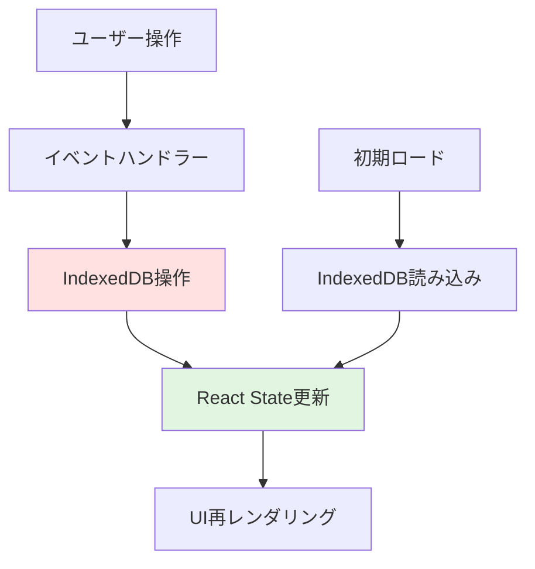

# Phase 5: 買い物リスト機能実装

**作成日**: 2025年10月23日
**Phase番号**: Phase 5 / 6
**所要時間**: 120分
**難易度**: 中級〜上級

---

## 目次

1. [Phase概要](#phase概要)
2. [状態管理設計](#状態管理設計)
3. [アイテム追加機能](#アイテム追加機能)
4. [アイテム編集機能](#アイテム編集機能)
5. [アイテム削除機能](#アイテム削除機能)
6. [チェック機能](#チェック機能)
7. [カテゴリーフィルター](#カテゴリーフィルター)
8. [完了アイテム表示/非表示](#完了アイテム表示非表示)
9. [完了アイテム一括削除](#完了アイテム一括削除)
10. [アニメーション実装](#アニメーション実装)
11. [エラーハンドリング](#エラーハンドリング)
12. [パフォーマンス最適化](#パフォーマンス最適化)
13. [統合テスト](#統合テスト)
14. [チェックリスト](#チェックリスト)
15. [次のステップ](#次のステップ)

---

## Phase概要

### 目的

Phase 4で作成したUIコンポーネントとPhase 3で実装したIndexedDB操作を統合し、完全に動作する買い物リストアプリを完成させます。このPhaseはOfflistの**心臓部**であり、オフラインファーストの真価が発揮されるレイヤーです。

### プロジェクトにおける位置づけ

```
Phase 3 (IndexedDB) ┐
                     ├→ Phase 5 (機能統合) → Phase 6 (デプロイ)
Phase 4 (UI)        ┘
```

Phase 5では、データレイヤー（IndexedDB）とプレゼンテーションレイヤー（React UI）を接続し、ユーザーの操作が即座にデータベースに反映される**リアルタイム同期**を実現します。

### 所要時間の内訳

| タスク | 時間 |
|--------|------|
| カスタムフック実装（useShoppingList） | 20分 |
| アイテム追加機能 | 15分 |
| アイテム編集機能（モーダル） | 15分 |
| アイテム削除機能（確認ダイアログ） | 15分 |
| チェック機能 | 10分 |
| カテゴリーフィルター | 10分 |
| 完了アイテム表示/非表示 | 10分 |
| 完了アイテム一括削除 | 10分 |
| アニメーション実装 | 15分 |
| 統合テスト・デバッグ | 10分 |
| **合計** | **120分** |

### コア原則: オフラインファースト

```typescript
// 従来型（サーバー依存）
ユーザー操作 → API → サーバーDB → レスポンス → UI更新
              ↑
          ネットワーク必須

// Offlist（オフラインファースト）
ユーザー操作 → IndexedDB → UI更新
              ↑
          ローカル完結
```

すべての操作は**即座にIndexedDBに保存**され、ネットワーク接続に一切依存しません。

---

## 状態管理設計

### データフローアーキテクチャ



### 状態管理戦略

#### React Hooksの役割分担

| Hook | 用途 | 例 |
|------|------|---|
| **useState** | UIの状態管理 | フィルター、モーダル表示/非表示 |
| **useEffect** | 副作用（DB操作） | 初期ロード、データ同期 |
| **useMemo** | パフォーマンス最適化 | フィルタリング済みリストのメモ化 |
| **useCallback** | 関数のメモ化 | イベントハンドラーの再生成防止 |

### カスタムフック: useShoppingList

Phase 5の核となるカスタムフックを実装します。このフックはIndexedDB操作とReact Stateを統合し、コンポーネントにクリーンなAPIを提供します。

#### ファイル: `lib/hooks/useShoppingList.ts`

```typescript
'use client';

import { useState, useEffect, useCallback } from 'react';
import { ShoppingItem, Category } from '@/types';
import {
  getAllItems,
  addItem,
  updateItem,
  deleteItem,
  toggleItemChecked,
  deleteCheckedItems,
} from '@/lib/db';

export function useShoppingList() {
  // State管理
  const [items, setItems] = useState<ShoppingItem[]>([]);
  const [loading, setLoading] = useState<boolean>(true);
  const [error, setError] = useState<string | null>(null);

  // 初期ロード: IndexedDBからデータを取得
  useEffect(() => {
    const loadItems = async () => {
      try {
        setLoading(true);
        const data = await getAllItems();
        setItems(data);
        setError(null);
      } catch (err) {
        console.error('Failed to load items:', err);
        setError('データの読み込みに失敗しました');
      } finally {
        setLoading(false);
      }
    };

    loadItems();
  }, []);

  // アイテム追加
  const handleAddItem = useCallback(
    async (item: Omit<ShoppingItem, 'id' | 'createdAt' | 'updatedAt'>) => {
      try {
        const newItemId = await addItem(item);
        // IndexedDBから最新のデータを再取得（楽観的更新も可能）
        const updatedItems = await getAllItems();
        setItems(updatedItems);
        return newItemId;
      } catch (err) {
        console.error('Failed to add item:', err);
        throw new Error('アイテムの追加に失敗しました');
      }
    },
    []
  );

  // アイテム更新
  const handleUpdateItem = useCallback(
    async (id: string, updates: Partial<ShoppingItem>) => {
      try {
        await updateItem(id, updates);
        const updatedItems = await getAllItems();
        setItems(updatedItems);
      } catch (err) {
        console.error('Failed to update item:', err);
        throw new Error('アイテムの更新に失敗しました');
      }
    },
    []
  );

  // アイテム削除
  const handleDeleteItem = useCallback(async (id: string) => {
    try {
      await deleteItem(id);
      const updatedItems = await getAllItems();
      setItems(updatedItems);
    } catch (err) {
      console.error('Failed to delete item:', err);
      throw new Error('アイテムの削除に失敗しました');
    }
  }, []);

  // チェック状態トグル
  const handleToggleCheck = useCallback(async (id: string) => {
    try {
      await toggleItemChecked(id);
      const updatedItems = await getAllItems();
      setItems(updatedItems);
    } catch (err) {
      console.error('Failed to toggle item:', err);
      throw new Error('チェック状態の変更に失敗しました');
    }
  }, []);

  // 完了アイテム一括削除
  const handleDeleteChecked = useCallback(async () => {
    try {
      const deletedCount = await deleteCheckedItems();
      const updatedItems = await getAllItems();
      setItems(updatedItems);
      return deletedCount;
    } catch (err) {
      console.error('Failed to delete checked items:', err);
      throw new Error('完了アイテムの削除に失敗しました');
    }
  }, []);

  return {
    items,
    loading,
    error,
    addItem: handleAddItem,
    updateItem: handleUpdateItem,
    deleteItem: handleDeleteItem,
    toggleCheck: handleToggleCheck,
    deleteChecked: handleDeleteChecked,
  };
}
```

#### 使用例

```typescript
const {
  items,
  loading,
  error,
  addItem,
  updateItem,
  deleteItem,
  toggleCheck,
  deleteChecked,
} = useShoppingList();
```

---

## アイテム追加機能

### 機能仕様

- 入力フォームから新しいアイテムを追加
- バリデーション（商品名必須、1-50文字）
- IndexedDBに保存
- リストの先頭に即座に表示
- 送信後にフォームをクリア

### 実装: AddItemForm統合

#### ファイル: `components/AddItemForm.tsx`（完全版）

```typescript
'use client';

import { useState, FormEvent } from 'react';
import { Category } from '@/types';

interface AddItemFormProps {
  onItemAdded: (item: {
    name: string;
    category: Category;
    checked: boolean;
    quantity?: number;
    memo?: string;
  }) => Promise<void>;
}

export default function AddItemForm({ onItemAdded }: AddItemFormProps) {
  const [name, setName] = useState('');
  const [category, setCategory] = useState<Category>('food');
  const [quantity, setQuantity] = useState<number>(1);
  const [memo, setMemo] = useState('');
  const [isSubmitting, setIsSubmitting] = useState(false);

  const handleSubmit = async (e: FormEvent) => {
    e.preventDefault();
    if (!name.trim() || name.length > 50) return;

    setIsSubmitting(true);
    try {
      await onItemAdded({
        name: name.trim(),
        category,
        checked: false,
        quantity,
        memo: memo.trim(),
      });

      // フォームリセット
      setName('');
      setCategory('food');
      setQuantity(1);
      setMemo('');
    } catch (error) {
      console.error('Failed to add item:', error);
      alert('アイテムの追加に失敗しました');
    } finally {
      setIsSubmitting(false);
    }
  };

  return (
    <form onSubmit={handleSubmit} className="bg-white rounded-lg shadow-md p-4 mb-4">
      <div className="mb-3">
        <input
          type="text"
          value={name}
          onChange={(e) => setName(e.target.value)}
          placeholder="アイテム名 (例: りんご)"
          maxLength={50}
          required
          className="input-field"
          disabled={isSubmitting}
        />
        {name.length > 0 && (
          <p className="text-xs text-gray-500 mt-1">
            {name.length} / 50 文字
          </p>
        )}
      </div>

      <div className="grid grid-cols-2 gap-3 mb-3">
        <select
          value={category}
          onChange={(e) => setCategory(e.target.value as Category)}
          className="px-4 py-3 border border-gray-300 rounded-lg focus:ring-2 focus:ring-primary outline-none"
          disabled={isSubmitting}
        >
          <option value="food">🍎 食品</option>
          <option value="daily">🧴 日用品</option>
          <option value="other">📦 その他</option>
        </select>

        <input
          type="number"
          value={quantity}
          onChange={(e) => setQuantity(Number(e.target.value))}
          min="1"
          max="999"
          className="px-4 py-3 border border-gray-300 rounded-lg focus:ring-2 focus:ring-primary outline-none"
          disabled={isSubmitting}
        />
      </div>

      <div className="mb-3">
        <input
          type="text"
          value={memo}
          onChange={(e) => setMemo(e.target.value)}
          placeholder="メモ (オプション)"
          maxLength={100}
          className="input-field"
          disabled={isSubmitting}
        />
      </div>

      <button
        type="submit"
        disabled={isSubmitting || !name.trim()}
        className="btn-primary w-full"
      >
        {isSubmitting ? '追加中...' : '追加'}
      </button>
    </form>
  );
}
```

### バリデーションルール

| フィールド | ルール | エラーメッセージ |
|-----------|--------|---------------|
| 商品名 | 必須、1-50文字 | 「商品名を入力してください」 |
| カテゴリー | food/daily/other | （選択制なのでエラーなし） |
| 数量 | 1-999 | （HTML5バリデーション） |
| メモ | 0-100文字（任意） | - |

---

## アイテム編集機能

### 機能仕様

- アイテムをクリックで編集モーダル表示
- 現在の値がフォームに入力済み
- 保存ボタンでIndexedDB更新
- キャンセルボタン、モーダル外クリック、Escキーで閉じる

### 実装: EditItemModal統合

#### ファイル: `components/EditItemModal.tsx`（完全版）

```typescript
'use client';

import { useState, useEffect, FormEvent } from 'react';
import { ShoppingItem, Category } from '@/types';

interface EditItemModalProps {
  item: ShoppingItem | null;
  onClose: () => void;
  onItemUpdated: (id: string, updates: Partial<ShoppingItem>) => Promise<void>;
}

export default function EditItemModal({ item, onClose, onItemUpdated }: EditItemModalProps) {
  const [name, setName] = useState('');
  const [category, setCategory] = useState<Category>('food');
  const [quantity, setQuantity] = useState<number>(1);
  const [memo, setMemo] = useState('');
  const [isSubmitting, setIsSubmitting] = useState(false);

  // アイテムが変更されたらフォームを初期化
  useEffect(() => {
    if (item) {
      setName(item.name);
      setCategory(item.category);
      setQuantity(item.quantity || 1);
      setMemo(item.memo || '');
    }
  }, [item]);

  // Escキーで閉じる
  useEffect(() => {
    const handleEscape = (e: KeyboardEvent) => {
      if (e.key === 'Escape') onClose();
    };
    if (item) {
      window.addEventListener('keydown', handleEscape);
      return () => window.removeEventListener('keydown', handleEscape);
    }
  }, [item, onClose]);

  if (!item) return null;

  const handleSubmit = async (e: FormEvent) => {
    e.preventDefault();
    if (!name.trim()) return;

    setIsSubmitting(true);
    try {
      await onItemUpdated(item.id, {
        name: name.trim(),
        category,
        quantity,
        memo: memo.trim(),
      });
      onClose();
    } catch (error) {
      console.error('Failed to update item:', error);
      alert('更新に失敗しました');
    } finally {
      setIsSubmitting(false);
    }
  };

  return (
    <div
      className="fixed inset-0 bg-black bg-opacity-50 flex items-center justify-center z-50 p-4"
      onClick={onClose}
    >
      <div
        className="bg-white rounded-lg shadow-xl max-w-md w-full p-6 animate-fadeIn"
        onClick={(e) => e.stopPropagation()}
      >
        <h2 className="text-xl font-bold mb-4">アイテムを編集</h2>
        <form onSubmit={handleSubmit}>
          <div className="mb-3">
            <label className="block text-sm font-medium mb-1">商品名</label>
            <input
              type="text"
              value={name}
              onChange={(e) => setName(e.target.value)}
              maxLength={50}
              required
              className="input-field"
              disabled={isSubmitting}
            />
          </div>

          <div className="grid grid-cols-2 gap-3 mb-3">
            <div>
              <label className="block text-sm font-medium mb-1">カテゴリー</label>
              <select
                value={category}
                onChange={(e) => setCategory(e.target.value as Category)}
                className="px-4 py-3 border border-gray-300 rounded-lg focus:ring-2 focus:ring-primary outline-none w-full"
                disabled={isSubmitting}
              >
                <option value="food">🍎 食品</option>
                <option value="daily">🧴 日用品</option>
                <option value="other">📦 その他</option>
              </select>
            </div>

            <div>
              <label className="block text-sm font-medium mb-1">数量</label>
              <input
                type="number"
                value={quantity}
                onChange={(e) => setQuantity(Number(e.target.value))}
                min="1"
                max="999"
                className="px-4 py-3 border border-gray-300 rounded-lg focus:ring-2 focus:ring-primary outline-none w-full"
                disabled={isSubmitting}
              />
            </div>
          </div>

          <div className="mb-4">
            <label className="block text-sm font-medium mb-1">メモ</label>
            <input
              type="text"
              value={memo}
              onChange={(e) => setMemo(e.target.value)}
              placeholder="メモ"
              maxLength={100}
              className="input-field"
              disabled={isSubmitting}
            />
          </div>

          <div className="flex gap-3">
            <button
              type="button"
              onClick={onClose}
              className="flex-1 py-3 border border-gray-300 rounded-lg hover:bg-gray-50 transition-colors"
              disabled={isSubmitting}
            >
              キャンセル
            </button>
            <button
              type="submit"
              disabled={isSubmitting}
              className="flex-1 bg-primary text-white py-3 rounded-lg hover:bg-primary-dark disabled:opacity-50 transition-colors"
            >
              {isSubmitting ? '保存中...' : '保存'}
            </button>
          </div>
        </form>
      </div>
    </div>
  );
}
```

---

## アイテム削除機能

### 機能仕様

- 削除ボタンクリックで確認ダイアログ表示
- 「削除」で即座にIndexedDBから削除
- フェードアウトアニメーションで視覚的フィードバック

### 実装: 確認ダイアログコンポーネント

#### ファイル: `components/ConfirmDialog.tsx`

```typescript
'use client';

interface ConfirmDialogProps {
  isOpen: boolean;
  title: string;
  message: string;
  confirmLabel?: string;
  cancelLabel?: string;
  onConfirm: () => void;
  onCancel: () => void;
}

export default function ConfirmDialog({
  isOpen,
  title,
  message,
  confirmLabel = '削除',
  cancelLabel = 'キャンセル',
  onConfirm,
  onCancel,
}: ConfirmDialogProps) {
  if (!isOpen) return null;

  return (
    <div
      className="fixed inset-0 bg-black bg-opacity-50 flex items-center justify-center z-50 p-4"
      onClick={onCancel}
    >
      <div
        className="bg-white rounded-lg shadow-xl max-w-sm w-full p-6 animate-fadeIn"
        onClick={(e) => e.stopPropagation()}
      >
        <h3 className="text-lg font-bold mb-2">{title}</h3>
        <p className="text-gray-600 mb-6">{message}</p>
        <div className="flex gap-3">
          <button
            onClick={onCancel}
            className="flex-1 py-2 border border-gray-300 rounded-lg hover:bg-gray-50 transition-colors"
          >
            {cancelLabel}
          </button>
          <button
            onClick={onConfirm}
            className="flex-1 bg-red-600 text-white py-2 rounded-lg hover:bg-red-700 transition-colors"
          >
            {confirmLabel}
          </button>
        </div>
      </div>
    </div>
  );
}
```

### ShoppingItemコンポーネントでの使用

```typescript
const [deleteConfirm, setDeleteConfirm] = useState<string | null>(null);

// 削除ボタン
<button
  onClick={() => setDeleteConfirm(item.id)}
  className="text-red-600 hover:text-red-700 px-2 py-1"
>
  削除
</button>

// 確認ダイアログ
<ConfirmDialog
  isOpen={deleteConfirm === item.id}
  title="アイテムを削除"
  message="このアイテムを削除しますか?"
  onConfirm={async () => {
    await onDelete(item.id);
    setDeleteConfirm(null);
  }}
  onCancel={() => setDeleteConfirm(null)}
/>
```

---

## チェック機能

### 機能仕様

- チェックボックスクリックで購入済み/未購入を切り替え
- チェック済みアイテムは取り消し線と薄いグレー表示
- 即座にIndexedDBに保存

### 実装: チェック状態の視覚的変化

#### ファイル: `components/ShoppingItem.tsx`（チェック部分）

```typescript
export default function ShoppingItem({
  item,
  onToggleCheck,
  onEdit,
  onDelete,
}: ShoppingItemProps) {
  const categoryEmoji = {
    food: '🍎',
    daily: '🧴',
    other: '📦',
  };

  return (
    <div
      className={`bg-white rounded-lg shadow-sm p-4 mb-2 transition-all duration-300 ${
        item.checked ? 'opacity-60' : ''
      }`}
    >
      <div className="flex items-center gap-3">
        {/* チェックボックス */}
        <input
          type="checkbox"
          checked={item.checked}
          onChange={() => onToggleCheck(item.id)}
          className="w-5 h-5 rounded border-gray-300 text-primary focus:ring-primary cursor-pointer transition-transform hover:scale-110"
        />

        <div className="flex-1">
          <div className="flex items-center gap-2">
            <span className="text-lg">{categoryEmoji[item.category]}</span>
            {/* チェック済みは取り消し線 */}
            <span
              className={`font-medium transition-all ${
                item.checked ? 'line-through text-gray-500' : 'text-gray-900'
              }`}
            >
              {item.name}
            </span>
            {item.quantity && item.quantity > 1 && (
              <span className="text-sm text-gray-500">x{item.quantity}</span>
            )}
          </div>
          {item.memo && (
            <p className="text-sm text-gray-600 mt-1 ml-7">{item.memo}</p>
          )}
        </div>

        <div className="flex gap-2">
          <button
            onClick={() => onEdit(item)}
            className="text-primary hover:text-primary-dark px-2 py-1 transition-colors"
          >
            編集
          </button>
          <button
            onClick={() => onDelete(item.id)}
            className="text-red-600 hover:text-red-700 px-2 py-1 transition-colors"
          >
            削除
          </button>
        </div>
      </div>
    </div>
  );
}
```

### チェックアニメーション（オプション）

```typescript
// チェック時にスケールアニメーション
<input
  type="checkbox"
  checked={item.checked}
  onChange={() => onToggleCheck(item.id)}
  className="w-5 h-5 rounded border-gray-300 text-primary focus:ring-primary cursor-pointer transition-transform hover:scale-110 checked:scale-110"
/>
```

---

## カテゴリーフィルター

### 機能仕様

- タブ型ボタンでカテゴリー切り替え
- 「全て」「食品」「日用品」「その他」
- フィルタリングはクライアント側で実行（高速）

### 実装: フィルター状態管理

#### ファイル: `app/page.tsx`（メインページ）

```typescript
'use client';

import { useState, useMemo } from 'react';
import { useShoppingList } from '@/lib/hooks/useShoppingList';
import { Category } from '@/types';
import AddItemForm from '@/components/AddItemForm';
import ShoppingItem from '@/components/ShoppingItem';
import CategoryFilter from '@/components/CategoryFilter';
import EditItemModal from '@/components/EditItemModal';

export default function Home() {
  const {
    items,
    loading,
    error,
    addItem,
    updateItem,
    deleteItem,
    toggleCheck,
    deleteChecked,
  } = useShoppingList();

  const [selectedCategory, setSelectedCategory] = useState<Category | 'all'>('all');
  const [showCompleted, setShowCompleted] = useState(true);
  const [editingItem, setEditingItem] = useState<ShoppingItem | null>(null);

  // フィルタリング済みアイテム（useMemoで最適化）
  const filteredItems = useMemo(() => {
    let result = items;

    // カテゴリーフィルター
    if (selectedCategory !== 'all') {
      result = result.filter((item) => item.category === selectedCategory);
    }

    // 完了アイテム表示/非表示
    if (!showCompleted) {
      result = result.filter((item) => !item.checked);
    }

    return result;
  }, [items, selectedCategory, showCompleted]);

  if (loading) {
    return (
      <div className="min-h-screen flex items-center justify-center">
        <p className="text-gray-500">読み込み中...</p>
      </div>
    );
  }

  if (error) {
    return (
      <div className="min-h-screen flex items-center justify-center">
        <p className="text-red-600">{error}</p>
      </div>
    );
  }

  return (
    <main className="min-h-screen bg-gray-50 pb-20">
      <div className="max-w-2xl mx-auto p-4">
        <header className="mb-6">
          <h1 className="text-3xl font-bold text-gray-900">Offlist</h1>
          <p className="text-gray-600">オフライン買い物リスト</p>
        </header>

        {/* アイテム追加フォーム */}
        <AddItemForm onItemAdded={addItem} />

        {/* カテゴリーフィルター */}
        <CategoryFilter
          selectedCategory={selectedCategory}
          onFilterChange={setSelectedCategory}
        />

        {/* アイテムリスト */}
        <div className="mb-4">
          {filteredItems.length === 0 ? (
            <div className="text-center py-12">
              <p className="text-gray-500">アイテムがありません</p>
            </div>
          ) : (
            filteredItems.map((item) => (
              <ShoppingItem
                key={item.id}
                item={item}
                onToggleCheck={toggleCheck}
                onEdit={setEditingItem}
                onDelete={deleteItem}
              />
            ))
          )}
        </div>

        {/* 編集モーダル */}
        <EditItemModal
          item={editingItem}
          onClose={() => setEditingItem(null)}
          onItemUpdated={updateItem}
        />
      </div>
    </main>
  );
}
```

---

## 完了アイテム表示/非表示

### 機能仕様

- トグルボタンで完了アイテムの表示を切り替え
- デフォルトは表示状態
- 非表示時は未完了アイテムのみ表示

### 実装: トグルボタン

```typescript
{/* 完了アイテム表示/非表示トグル */}
<div className="flex items-center justify-between mb-4">
  <button
    onClick={() => setShowCompleted(!showCompleted)}
    className="text-sm text-primary hover:text-primary-dark transition-colors"
  >
    {showCompleted ? '✓ 完了済みを表示中' : '✗ 完了済みを非表示'}
  </button>
  <span className="text-sm text-gray-500">
    {items.filter((i) => !i.checked).length} / {items.length} 件
  </span>
</div>
```

---

## 完了アイテム一括削除

### 機能仕様

- ボタンクリックで完了アイテムを一括削除
- 確認ダイアログで誤操作防止
- 削除件数を表示

### 実装: フッターボタン

```typescript
const [showDeleteConfirm, setShowDeleteConfirm] = useState(false);

// 完了アイテム数を計算
const checkedCount = items.filter((item) => item.checked).length;

// フッター
<footer className="fixed bottom-0 left-0 right-0 bg-white border-t border-gray-200 p-4">
  <div className="max-w-2xl mx-auto flex justify-between items-center">
    <button
      onClick={() => setShowDeleteConfirm(true)}
      disabled={checkedCount === 0}
      className="px-4 py-2 bg-red-600 text-white rounded-lg hover:bg-red-700 disabled:opacity-50 disabled:cursor-not-allowed transition-colors"
    >
      完了済みを削除 ({checkedCount})
    </button>

    <div className="text-sm text-gray-600">
      オフライン動作中
    </div>
  </div>
</footer>

{/* 削除確認ダイアログ */}
<ConfirmDialog
  isOpen={showDeleteConfirm}
  title="完了アイテムを削除"
  message={`${checkedCount}件の完了アイテムを削除しますか?`}
  onConfirm={async () => {
    await deleteChecked();
    setShowDeleteConfirm(false);
  }}
  onCancel={() => setShowDeleteConfirm(false)}
/>
```

---

## アニメーション実装

### アニメーション戦略

| アクション | アニメーション | 効果 |
|-----------|--------------|------|
| アイテム追加 | スライドイン + フェードイン | 新規追加を強調 |
| アイテム削除 | フェードアウト | スムーズな削除 |
| チェック | スケール | 視覚的フィードバック |
| モーダル表示 | フェードイン | 自然な表示 |

### Tailwind CSSアニメーション

#### 既存の設定（tailwind.config.ts）

```typescript
animation: {
  'slideUp': 'slideUp 0.3s ease-out',
  'fadeIn': 'fadeIn 0.2s ease-out',
},
keyframes: {
  slideUp: {
    '0%': { transform: 'translateY(100%)' },
    '100%': { transform: 'translateY(0)' },
  },
  fadeIn: {
    '0%': { opacity: '0' },
    '100%': { opacity: '1' },
  },
},
```

### 追加アニメーション（オプション: Framer Motion）

#### インストール

```bash
npm install framer-motion
```

#### 使用例: ShoppingItemにスライドイン

```typescript
import { motion } from 'framer-motion';

export default function ShoppingItem({ item, ... }: ShoppingItemProps) {
  return (
    <motion.div
      initial={{ opacity: 0, y: -10 }}
      animate={{ opacity: 1, y: 0 }}
      exit={{ opacity: 0, x: 100 }}
      transition={{ duration: 0.2 }}
      className={`bg-white rounded-lg shadow-sm p-4 mb-2 ${
        item.checked ? 'opacity-60' : ''
      }`}
    >
      {/* アイテム内容 */}
    </motion.div>
  );
}
```

#### リスト全体にアニメーション

```typescript
import { AnimatePresence } from 'framer-motion';

<AnimatePresence>
  {filteredItems.map((item) => (
    <ShoppingItem
      key={item.id}
      item={item}
      onToggleCheck={toggleCheck}
      onEdit={setEditingItem}
      onDelete={deleteItem}
    />
  ))}
</AnimatePresence>
```

---

## エラーハンドリング

### エラーシナリオ

| エラー | 原因 | 対処 |
|--------|------|------|
| IndexedDB初期化失敗 | ブラウザ非対応 | エラーメッセージ表示 |
| アイテム追加失敗 | 容量不足 | トースト通知 |
| ネットワークなし | - | 問題なし（オフライン対応） |

### トースト通知コンポーネント

#### ファイル: `components/Toast.tsx`

```typescript
'use client';

import { useEffect } from 'react';

interface ToastProps {
  message: string;
  type: 'success' | 'error' | 'info';
  onClose: () => void;
  duration?: number;
}

export default function Toast({ message, type, onClose, duration = 3000 }: ToastProps) {
  useEffect(() => {
    const timer = setTimeout(onClose, duration);
    return () => clearTimeout(timer);
  }, [duration, onClose]);

  const colors = {
    success: 'bg-green-500',
    error: 'bg-red-500',
    info: 'bg-blue-500',
  };

  return (
    <div className="fixed top-4 left-1/2 transform -translate-x-1/2 z-50 animate-slideUp">
      <div className={`${colors[type]} text-white px-6 py-3 rounded-lg shadow-lg`}>
        {message}
      </div>
    </div>
  );
}
```

### 使用例

```typescript
const [toast, setToast] = useState<{ message: string; type: 'success' | 'error' } | null>(null);

// アイテム追加時
try {
  await addItem(newItem);
  setToast({ message: 'アイテムを追加しました', type: 'success' });
} catch (error) {
  setToast({ message: 'アイテムの追加に失敗しました', type: 'error' });
}

// トースト表示
{toast && (
  <Toast
    message={toast.message}
    type={toast.type}
    onClose={() => setToast(null)}
  />
)}
```

---

## パフォーマンス最適化

### useMemoの活用

```typescript
// フィルタリング済みアイテムをメモ化
const filteredItems = useMemo(() => {
  let result = items;

  if (selectedCategory !== 'all') {
    result = result.filter((item) => item.category === selectedCategory);
  }

  if (!showCompleted) {
    result = result.filter((item) => !item.checked);
  }

  return result;
}, [items, selectedCategory, showCompleted]);
```

### useCallbackの活用

```typescript
// イベントハンドラーをメモ化
const handleAddItem = useCallback(
  async (item: Omit<ShoppingItem, 'id' | 'createdAt' | 'updatedAt'>) => {
    try {
      const newItemId = await addItem(item);
      const updatedItems = await getAllItems();
      setItems(updatedItems);
      return newItemId;
    } catch (err) {
      console.error('Failed to add item:', err);
      throw new Error('アイテムの追加に失敗しました');
    }
  },
  []
);
```

### React.memoでコンポーネント最適化

```typescript
import { memo } from 'react';

const ShoppingItem = memo(({ item, onToggleCheck, onEdit, onDelete }: ShoppingItemProps) => {
  // コンポーネント実装
});

export default ShoppingItem;
```

---

## 統合テスト

### テストシナリオ

#### 1. アイテム追加テスト

```
1. アイテム名「りんご」を入力
2. カテゴリー「食品」を選択
3. 「追加」ボタンクリック
4. リストの先頭に表示されることを確認
5. フォームがクリアされることを確認
6. DevTools → Application → IndexedDB でデータ確認
```

#### 2. チェック機能テスト

```
1. アイテムのチェックボックスをクリック
2. 取り消し線と薄いグレー表示になることを確認
3. 再度クリック
4. 元のスタイルに戻ることを確認
5. IndexedDBで`checked`プロパティが更新されていることを確認
```

#### 3. 編集機能テスト

```
1. アイテムの「編集」ボタンをクリック
2. モーダルが表示されることを確認
3. 商品名を「牛乳」に変更
4. 「保存」ボタンクリック
5. リストに反映されることを確認
6. IndexedDBで更新されていることを確認
```

#### 4. 削除機能テスト

```
1. アイテムの「削除」ボタンをクリック
2. 確認ダイアログが表示されることを確認
3. 「削除」ボタンクリック
4. リストから消えることを確認
5. IndexedDBから削除されていることを確認
```

#### 5. カテゴリーフィルターテスト

```
1. 「食品」タブをクリック
2. 食品カテゴリーのみ表示されることを確認
3. 「全て」タブをクリック
4. 全アイテムが表示されることを確認
```

#### 6. 完了アイテム一括削除テスト

```
1. 複数のアイテムをチェック
2. 「完了済みを削除」ボタンクリック
3. 確認ダイアログが表示されることを確認
4. 「削除」ボタンクリック
5. チェック済みアイテムがすべて削除されることを確認
```

### オフライン動作テスト

#### Chrome DevToolsでオフラインモード

```
1. Chrome DevTools → Network タブ
2. 「Offline」にチェック
3. アプリを操作
4. すべての機能が動作することを確認
```

#### 実機テスト（推奨）

```
1. スマートフォンでアプリにアクセス
2. 機内モードをON
3. アプリを操作
4. すべての機能が動作することを確認
```

---

## チェックリスト

### 機能実装

- [ ] カスタムフック `useShoppingList` 実装
- [ ] アイテム追加機能動作
- [ ] アイテム編集機能動作（モーダル）
- [ ] アイテム削除機能動作（確認ダイアログ）
- [ ] チェック機能動作
- [ ] チェック済みアイテムのスタイル変更（取り消し線、薄いグレー）
- [ ] カテゴリーフィルター動作
- [ ] 完了アイテム表示/非表示トグル動作
- [ ] 完了アイテム一括削除動作

### データ永続化

- [ ] すべての操作がIndexedDBに即座に保存される
- [ ] ページリロード後もデータが保持される
- [ ] オフライン時もすべての機能が動作する
- [ ] Chrome DevToolsでIndexedDBの内容を確認できる

### UI/UX

- [ ] アニメーションがスムーズ
- [ ] モーダルがEscキーで閉じる
- [ ] モーダル外クリックで閉じる
- [ ] ローディング状態表示
- [ ] エラーメッセージ表示
- [ ] トースト通知（オプション）

### パフォーマンス

- [ ] フィルタリングがuseMemoで最適化
- [ ] イベントハンドラーがuseCallbackでメモ化
- [ ] 不要な再レンダリングがない

### テスト

- [ ] 全機能の動作確認完了
- [ ] オフラインモードテスト成功
- [ ] 実機テスト成功（推奨）

---

## 次のステップ

### Phase 6へ進む準備

Phase 5が完了したら、次は本番デプロイに進みます:

**Phase 6の内容:**
- ビルド最適化
- Lighthouseテスト（PWAスコア100点目標）
- Vercelデプロイ設定
- 本番デプロイ
- 実機テスト
- オフライン動作テスト

**Phase 6ドキュメント:** `20251023_06-vercel-deployment.md`

### 追加機能の検討

Phase 6完了後、以下の拡張機能を検討できます:

- 検索機能
- ソート機能（名前順、追加順）
- アイテムのアーカイブ
- CSVエクスポート
- 複数リスト管理
- クラウド同期（Phase 7）

---

## まとめ

### Phase 5で達成したこと

- IndexedDBとReact UIの完全統合
- オフラインファーストのデータフロー確立
- 直感的なユーザー体験の実現
- スムーズなアニメーション実装
- エラーハンドリングとユーザーフィードバック

### 重要ポイント

1. **カスタムフック**: useShoppingListでデータロジックとUI分離
2. **即座の反映**: すべての操作がIndexedDBに即座に保存
3. **オフライン完結**: ネットワーク接続不要
4. **パフォーマンス**: useMemo/useCallbackで最適化

### Offlistの核心価値

```
ユーザー操作 → IndexedDB → 即座に反映
              ↑
        ネットワーク不要
```

Phase 5の完成により、Offlistは**機内モードでも完璧に動作する買い物リストアプリ**として完成しました。Phase 6でVercelにデプロイし、世界中の誰もがアクセスできるようにしましょう。

---

**ドキュメント作成者**: AI Agent (Claude)
**最終更新日**: 2025年10月23日
**バージョン**: 1.0
**関連ドキュメント**:
- [全体概要](./20251023_00-overview.md)
- [Phase 3: IndexedDB Setup](../ticket/initial/phase-03-indexeddb-setup.md)
- [Phase 4: UI Components](../ticket/initial/phase-04-ui-components.md)
- [Phase 6: Vercel Deployment](./20251023_06-vercel-deployment.md) (次のステップ)
